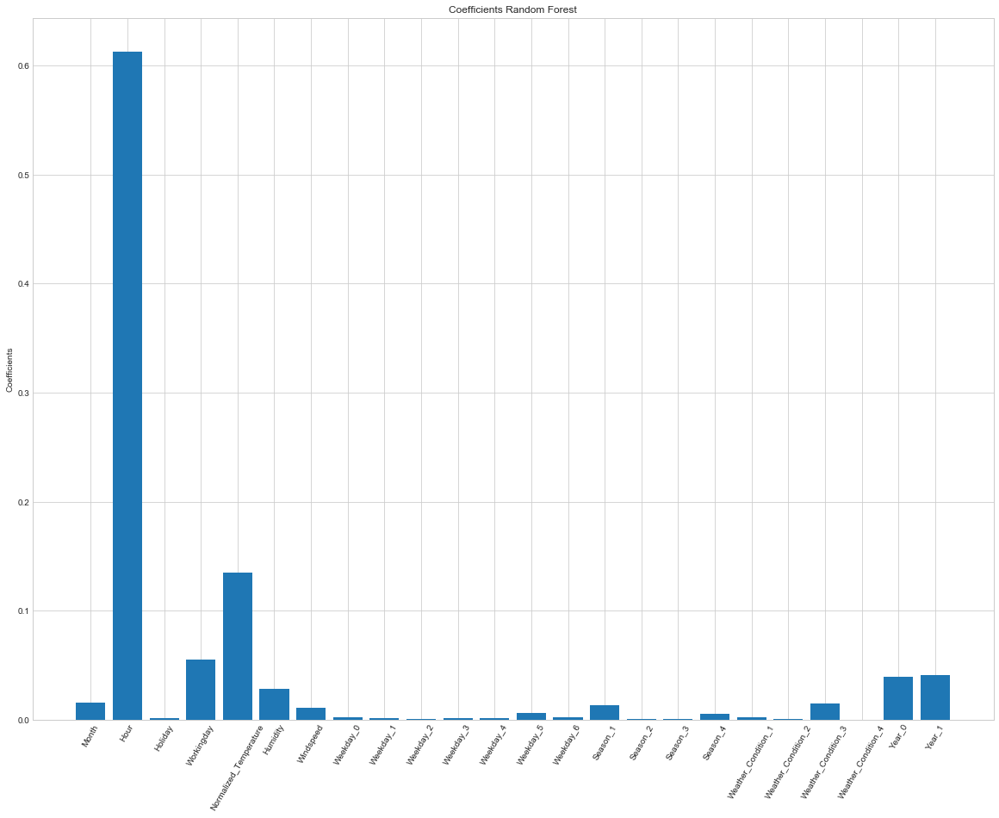

# Abstract
Bike sharing systems consist of a fleet of bikes placed in a network of docking stations. These bikes are rented and returned to any docking station after usage. Predicting the hourly bike demand for bike rentals (in general) will help in designing and expanding bike sharing system as well as maintaining adequate number of bikes at working stations. For this project, Hourly demand is predicted for bike sharing systems in Washington DC area. Weather and Holiday data is integrated for predicting bike demands and designed the model for predictions.

# Introduction
## Background

Bike sharing system is a service in which fleet of bicycles are available to individuals for shared use, allowing individuals to rent a bike from “Point x” and return to “Point y”. This system began in Europe and is currently available in more than 50 countries, Currently, there are over 500 bike-sharing programs around the world. Predicting ride sharing demand in general has become common problem to address, with emerging car sharing services in transport network companies such as Uber and Lyft. In United States, the bike sharing program was built on project insights from European and Canadian counterparts, with some differences in technology and operations like, short transit. An interest in bike share has been incited by success in several US cities, including Washington, DC, New York, Chicago, Denver and Minneapolis, where bike share has gained popularity as accepted transportation option. The heavy traffic in cities and desire for environment friendly medium of transportation are primarily cause of success. The data generated by these systems such as types of riders (casual, registered), hourly aggregated count of rentals motivated us to study mobility in city by combining historical usage patterns with weather data to forecast bike rental demand in the Capital Bike share program in Washington, D.C.

In our effort to predict bike rental demand on hourly basis. I tried various regression models with covariates like weather, day of week and time

## About Data
The data set is obtained from UCI bike sharing dataset (Kaggle competition), The core dataset is a two-year historical log corresponding to years 2011 and 2012 from Capital Bike share system, Washington D.C., USA which is publicly available in [capitalbikeshare](http://capitalbikeshare.com/system-data). It was aggregated with data on hourly basis and then extracted and added the corresponding weather and seasonal information. Weather information is extracted from [Weather](http://www.freemeteo.com).
This data is also combined with holiday data extracted from [Holiday](http://dchr.dc.gov/page/holiday-schedule)

Dataset has 17 features and 17379 rows of data with record id as index. The size of the dataset if 2.3MB.

Following are the features of the dataset
        
      1.	Instant: record index
      2.	Date : date
      3.	Season : season (1:springer, 2:summer, 3:fall, 4:winter)
      4.	Year : year (0: 2011, 1:2012)
      5.	Month : month ( 1 to 12)
      6.	Hour : hour (0 to 23)
      7.	Holiday : weather day is holiday or not
      8.	Weekday : day of the week
      9.	Workingday : if day is neither weekend nor holiday is 1, otherwise is 0.
      10.	Weather_Condition : 
                      1. Clear, Few clouds, Partly cloudy, Partly cloudy
                      2. Mist + Cloudy, Mist + Broken clouds, Mist + Few clouds, Mist
                      3. Light Snow, Light Rain + Thunderstorm + Scattered clouds, Light Rain + Scattered clouds
                      4. Heavy Rain + Ice Pallets + Thunderstorm + Mist, Snow + Fog
      11.	Normalized_Temperature : Normalized temperature in Celsius. The values are divided to 41 (max)
      12.	Normalized_Feels_Temperature : Normalized feeling temperature in Celsius. The values are divided to 50 (max)
      13.	Humidity: Normalized humidity. The values are divided to 100 (max)
      14.	Windspeed: Normalized wind speed. The values are divided to 67 (max)
      15.	Casual: count of casual users
      16.	Registered: count of registered users
      17.	Demand: count of total rental bikes including both casual and registered
      
# Data Exploration

To understand the different aspects of demand, we plotted different plots.

**Figure 1** *shows, the histogram of bike rental demand distribution, we can see close to 40% of rides per hour are in between 0 and 100.*

**Figure 2** *shows, a bar chart of Casual and Registered rides percentage contribution to the total demand for days of week, we notice that the casual rides increase during the weekends, but the registered riders contribute to higher percentage of overall demand.*

**Figure 3** *shows that the demand from Registered rides peak during morning and evening hours, whereas the casual riders have higher demands around noon.*

**Figure 4** *shows, a line plot of variation in demand during working and non-working days at an hourly basis, we can observe during working days the demand is higher in morning and evening and during non-working days demand is higher during afternoon, having a similarity in pattern with Figure 3, suggesting the demand on working days could be driven by registered users and on nonworking days by casual users.*

**Figure 5** *shows, a bar chart of demand for hourly intervals of the day, we notice that even though we noticed in Figure 4 that demand is high during morning and evening hours, it seems to reach peak between 4 - 8 PM.*

**Figure 6** *shows, a line plot of variation in demand for different seasons in a year, we can observe that the demand in Fall season highest is slightly higher than summer and the demand is lowest in spring season.*

**Figure 7** *shows, a scatter plot for demand variation for temperature, we observe the demand starts to decline at higher temperatures, this could be the reason for summer having slightly lower demand than Fall season.*

**Figure 8** *shows, that with very high wind speed the demand decreasing.*

**Figure 9** *shows, that with very high humidity levels the demand decreasing.*

**Figure 10** *suggests, in clear weather conditions the demand is higher*

**Figure 11** *Demand starts to decline for cloudy weather.

**Figure 12**, *Demand declines even further for snowy(rainy) conditions*

**Figure 13**, *Demand lowest for stormy weather.*

**Figure 14, 15** *shows, increase in average demand from year 2011* to year 2012 for similar weather conditions, making it clear that people are choosing a healthy life style and a convenient commute option.

**Figure 16** *shows, the correlation matrix for continuous variables like temperature, temperature felt, humidity and windspeed with the total count, registred users count and casual users count.*

Some of the observations obtained from the correlation matrix (Figure 16) are: 

- Temperature is positively correlated with the total users count. Temperature has a higher degree of positive correlation with casual bike rental count as compared to registered bike rental count. That means people prefer to ride a bike at cool to medium temperatures than cold temperatures in Washington DC. 
- Temperature felt (atemp) is very highly correlated with the actual temperature and hence it would be best to consider the only the temperature felt. 
- Humidity is negatively correlated with the total users count. Humidity has a higher degree of negative correlation with casual users count as compared to registered users count. This suggests that high humidity days like rainy season attracts less riders.
- Wind Speed is positively correlated with bike rental count but the correlation is low.

# Predictive Task

Our predictive task is to forecast bike rental demand of Bike sharing program in Washington, D.C based on historical usage patterns in relation with weather, day of week and hour of the day.

## Validation

I will be validating our model and tuning the hyperparameters using a 10-fold cross validation. I randomly shuffled our data set and used 1/3 of the data points as test set. I partitioned the remaining data set into 10 splits. In each of the 10 iterations we trained our model on 9 splits and calculated the RMSLE on the remaining split. On the basis of the average of 10 RMSLEs, we tuned our hyper parameters. After tuning the hyperparameters, we trained the model on the complete data set and evaluated the model on the test set. Thus, 10-fold cross validation was used to prevent overfitting.

## Feature Selection 

Based on the data exploration we decided to use the Independent Features mentioned below. 

**Normalized Temperature:** In the original dataset we had temperature and temperature felt as two different features. But since the correlation between temperature felt and temperature is too high, we hypothesised that dropping one feature would not affect the error. we decided to keep just the temperature as having less number of features reduces the complexity of models. 

**Weather Condition:** I used one-hot encoding to represent the weather: clear weather, misty weather, light snow/rain weather and heavy snow/rain weather. 

**Weekday:** Using the datetime stamp in our data set, we calculated the day of the week. I used one-hot encoding to represent the day of the week from Sunday through Saturday. 

**Date:** I extracted the date from the datetime stamp in the dataset. I used the day of the month as a feature. 

**Month:** I extracted the month from the date timestamp. I used one-hot encoding to represent the months between January and December. 

**Working day:** This is a boolean value, 1 for weekdays and 0 for weekends

**Season:** I used one-hot encoding to represent the four seasons: winter, spring, summer and fall. 

**Holiday:** This is a boolean value, 1 if it is a government holiday.

**Hour:** Hour is also extracted from the timestamp value present in the data set. I used one-hot encoding to represent the hour of the day. 

**Year:** As seen in the data exploration section, 2012 had much higher overall bike demand as compared to 2011. I used one-hot encoding to represent the year: 0 for 2011 and 1 for 2012.

**Humidity:**  Normalized humidity. The values are divided to 100 (max)

**Windspeed:** Normalized wind speed. The values are divided to 67 (max)

## Models

I run a model to predict the total demand (demand by registered users and demand by casual users).

I explored different types of parametric models based on the features mentioned above. Since this is a regression problem, we have to choose a regressor that can efficiently train our model, while taking into account that we have 17379 data points in our training set and around 12 features.

## Evaluating the Model

I will be evauluating the model on the basis of the Coefficient of Determination (R Square) and root-mean-square error (RMSE)

The coefficient of determination, R Square, tells us the percentage of the variance in the response variable y that can be explained by the linear regression model.
R Square=ESS/TSS (Explained Sum of Squares/Total Sum of Squares)
The R Square value is one of the most common metrics that people use in describing the quality of a model, but it is important to note that R Square *increases artificially as a side-effect of increasing the number of independent variables.* While R Square is reported in almost all statistical packages.

The root-mean-square deviation (RMSD) or root-mean-square error (RMSE) (or sometimes root-mean-squared error) is a frequently used measure of the differences between values (sample or population values) predicted by a model or an estimator and the values observed.

## Linear Regression
Linear regression attempts to model the relationship between two variables by fitting a linear equation to observed data. One variable is considered to be an explanatory variable, and the other is considered to be a dependent variable.

Linear Regression model is the first model applied to see the fit for the data features. I used Sklearn library from Linear Regression. 

## Decision Tree
A decision trees are a non-parametric supervised learning method, the goal is to create a model that predicts the value of a target variable by learning simple decision rules inferred from the data features.

I trained our model using Sklearn decision trees library for different values of max_depth (maximum depth of each tree in the forest) = [1,11,22,33,44] and max_features (number of features to consider while looking at the split) = [auto]. I found the cross validation RMSLE of 0.35074 with max_depth = 25 and Max_features = All the features.

## Random Forest
A random forest is a meta estimator that fits a number of classifying decision trees on various sub-samples of the dataset. To improve the predictive accuracy and control over-fitting, averaging is used. I trained our model using Sklearn random forest library for different values of n_estimators (number of trees in the forest) = [10,20,30,40,50,60,70,100] and max_depth (maximum depth of each tree in the forest) = [1,11,22,33,44] and max_features (number of features to consider while looking at the split) = [auto]. I found the cross validation RMSLE of 0.35074 with n_estimator = 100, max_depth = 25 and Max_features = All the features.

## Results

Model | R Square | RMSE 
--- | --- | ---
*Linear Regression* | `0.159` | `143.74` 
*Ridge Regression* | `0.158` | `143.73`
*Lasso Regression* | `0.18` | `143.98`
*Decision Tree* | `0.65` | `84.81`
*Random Forest* | `0.789` | `63.86`

From the above results we see that the ensemble methods works better than the linear regression. Few of the reason why these methods worked better are: 

- Decision trees are the base regressor for all the ensembles methods used. Using decision trees we are able to model the complex nonlinear interaction between the features. 
- With decision trees, if two features are strongly correlated, one of the features is arbitrarily chosen for a split and the other feature has no further effect on the model. Whereas the linear regression shows low performance when the features are correlated. 
- Linear regressor is not good at handling outliers, whereas the ensemble of decision trees are not affected much by the presence of outliers. 
- Though a single decision tree tends to overfit on the train data, ensemble of trees are better at preventing overfitting. To improve the performance of decision tree we used ensemble methods that reduces the bias and/or variance of the base regressors.

Random Forest regression with **R^2** score of **0.789** is a better fit for this dataset.

**Figure 17. Feature Importance for demand**

## Conclusion
I established significant relationship between several independent variables and Bikesharing ridership. I developed a regression model that can be applied directly to bike station business to predict hourly demand. I also found that the usage of bike rental is far more high for registered users as compared to casual user and the demand is maximum during morning and evening travel hours. Also weather has significant effect on bike ridership. A clear and sunny weather invites more riders as compared to rainy and snow weather. I trained various different models and performed featurization and found that Random Forest was best to capture the variance and non linearity of the dataset. It gave an **R^2** of 0.789 and **RMSE** of 63.86 on test set. I can thus conclude that the developed model can be used to predict the bike demand in urban environment. The model can be used by the Bike sharing company to strategically place the bikes depending on the forecast. They can also change their revenue model to introduce price surge during peak hours based on the forecast of demand.
