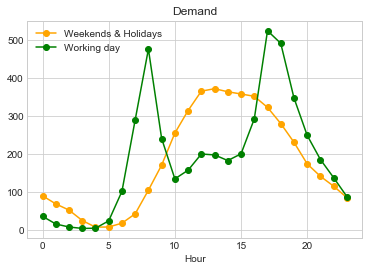

# Abstract
Bike sharing systems consist of a fleet of bikes placed in a network of docking stations. These bikes are rented and returned to any docking station after usage. Predicting the hourly bike demand for bike rentals (in general) will help in designing and expanding bike sharing system as well as maintaining adequate number of bikes at working stations. For this project, Hourly demand is predicted for bike sharing systems in Washington DC area. Weather and Holiday data is integrated for predicting bike demands and designed the model for predictions.

# Introduction
## Background

Bike sharing system is a service in which fleet of bicycles are available to individuals for shared use, allowing individuals to rent a bike from “Point x” and return to “Point y”. This system began in Europe and is currently available in more than 50 countries, Currently, there are over 500 bike-sharing programs around the world. Predicting ride sharing demand in general has become common problem to address, with emerging car sharing services in transport network companies such as Uber and Lyft. In United States, the bike sharing program was built on project insights from European and Canadian counterparts, with some differences in technology and operations like, short transit. An interest in bike share has been incited by success in several US cities, including Washington, DC, New York, Chicago, Denver and Minneapolis, where bike share has gained popularity as accepted transportation option. The heavy traffic in cities and desire for environment friendly medium of transportation are primarily cause of success. The data generated by these systems such as types of riders (casual, registered), hourly aggregated count of rentals motivated us to study mobility in city by combining historical usage patterns with weather data to forecast bike rental demand in the Capital Bike share program in Washington, D.C.

In our effort to predict bike rental demand on hourly basis. We tried various regression models with covariates like weather, day of week and time

## About Data
The data set is obtained from UCI bike sharing dataset (Kaggle competition), The core dataset is a two-year historical log corresponding to years 2011 and 2012 from Capital Bike share system, Washington D.C., USA which is publicly available in [capitalbikeshare](http://capitalbikeshare.com/system-data). It was aggregated with data on hourly basis and then extracted and added the corresponding weather and seasonal information. Weather information is extracted from [Weather](http://www.freemeteo.com).
This data is also combined with holiday data extracted from [Holiday](http://dchr.dc.gov/page/holiday-schedule)

Dataset has 17 features and 17379 rows of data with record id as index. The size of the dataset if 2.3MB.

Following are the features of the dataset
        
      1.	Instant: record index
      2.	Date : date
      3.	Season : season (1:springer, 2:summer, 3:fall, 4:winter)
      4.	Year : year (0: 2011, 1:2012)
      5.	Month : month ( 1 to 12)
      6.	Hour : hour (0 to 23)
      7.	Holiday : weather day is holiday or not
      8.	Weekday : day of the week
      9.	Workingday : if day is neither weekend nor holiday is 1, otherwise is 0.
      10.	Weather_Condition : 
                      1. Clear, Few clouds, Partly cloudy, Partly cloudy
                      2. Mist + Cloudy, Mist + Broken clouds, Mist + Few clouds, Mist
                      3. Light Snow, Light Rain + Thunderstorm + Scattered clouds, Light Rain + Scattered clouds
                      4. Heavy Rain + Ice Pallets + Thunderstorm + Mist, Snow + Fog
      11.	Normalized_Temperature : Normalized temperature in Celsius. The values are divided to 41 (max)
      12.	Normalized_Feels_Temperature : Normalized feeling temperature in Celsius. The values are divided to 50 (max)
      13.	Humidity: Normalized humidity. The values are divided to 100 (max)
      14.	Windspeed: Normalized wind speed. The values are divided to 67 (max)
      15.	Casual: count of casual users
      16.	Registered: count of registered users
      17.	Demand: count of total rental bikes including both casual and registered
      
# Data Exploration

To understand the different aspects of demand, we plotted different plots.

**Figure 1** *shows, the histogram of bike rental demand distribution, we can see close to 40% of rides per hour are in between 0 and 100.*

**Figure 2** *shows, a bar chart of Casual and Registered rides percentage contribution to the total demand for days of week, we notice that the casual rides increase during the weekends, but the registered riders contribute to higher percentage of overall demand.*

**Figure 3** *shows that the demand from Registered rides peak during morning and evening hours, whereas the casual riders have higher demands around noon.*

**Figure 4** *shows, a line plot of variation in demand during working and non-working days at an hourly basis, we can observe during working days the demand is higher in morning and evening and during non-working days demand is higher during afternoon, having a similarity in pattern with Figure 3, suggesting the demand on working days could be driven by registered users and on nonworking days by casual users.*

**Figure 5** *shows, a bar chart of demand for hourly intervals of the day, we notice that even though we noticed in Figure 4 that demand is high during morning and evening hours, it seems to reach peak between 4 - 8 PM.*

**Figure 6** *shows, a line plot of variation in demand for different seasons in a year, we can observe that the demand in Fall season highest is slightly higher than summer and the demand is lowest in spring season.*

**Figure 7** *shows, a scatter plot for demand variation for temperature, we observe the demand starts to decline at higher temperatures, this could be the reason for summer having slightly lower demand than Fall season.*

**Figure 8** *shows, that with very high wind speed the demand decreasing.*

**Figure 9** *shows, that with very high humidity levels the demand decreasing.*

**Figure 10** *suggests, in clear weather conditions the demand is higher*

**Figure 11** *Demand starts to decline for cloudy weather.

**Figure 12**, *Demand declines even further for snowy(rainy) conditions*

**Figure 13**, *Demand lowest for stormy weather.*
